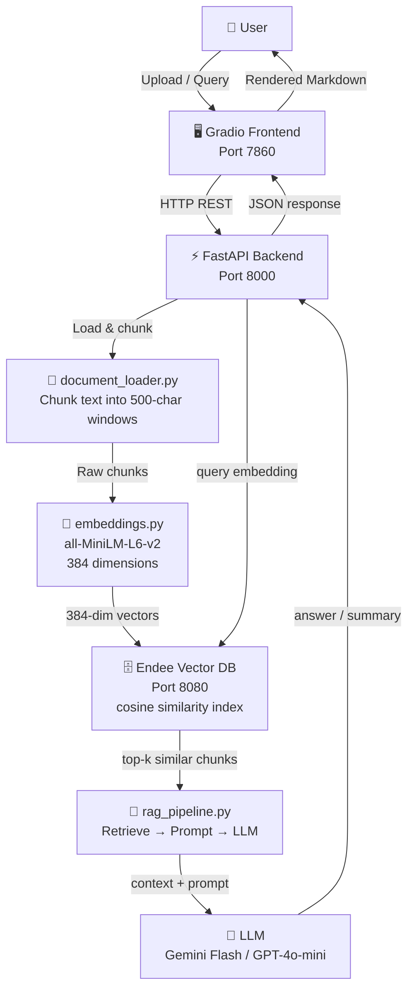

# 🧠 AI Document Summarizer & Semantic Search System

> **Built on [Endee](https://endee.io) — Open-Source High-Performance Vector Database**

[](https://python.org)
[](https://fastapi.tiangolo.com)
[](https://gradio.app)
[](https://endee.io)
[](LICENSE)

---

## 📖 Project Overview

The **AI Document Summarizer & Semantic Search System** is a production-style AI application that allows users to upload documents (PDF, TXT, Markdown), automatically generate embeddings, store them in the **Endee** vector database, and perform:

- 🔍 **Semantic Search** — find relevant passages using natural language
- 📝 **Document Summarization** — AI-generated structured summaries
- 💬 **Question Answering (RAG)** — ask questions; get grounded answers from the document

---

## 🎯 Problem Statement

Traditional document search relies on keyword matching, which fails to capture semantic meaning. A search for "neural network training speed" won't find a document talking about "faster model convergence via gradient descent optimisation" — even though they mean the same thing.

This project demonstrates how **vector search** solves this by:
1. Converting documents into mathematical meaning representations (embeddings)
2. Storing those embeddings in Endee, which supports efficient cosine similarity search
3. Retrieving semantically similar content and passing it to an LLM for intelligent answers

---

## 🏗️ Architecture



---

## 🛠️ Technical Design

### Embedding Model
- **Model**: `all-MiniLM-L6-v2` (Sentence Transformers)
- **Dimensions**: 384
- **Licence**: MIT — runs entirely locally, **no API key required**
- **Throughput**: ~2,000 sentences/second on modern hardware

### How Endee Is Used

| Operation | Endee SDK Call |
|-----------|---------------|
| Create vector index | `client.create_index(name="documents", dimension=384, space_type="cosine")` |
| Store document chunks | `index.upsert([{"id": ..., "vector": [...], "meta": {...}}])` |
| Similarity search | `index.query(vector=[...], top_k=5)` |

Each chunk is stored with rich metadata (doc_id, doc_name, chunk_index, original text) so results can be rendered with full context.

### RAG Pipeline

```
User Query
    │
    ▼
Embed query with all-MiniLM-L6-v2
    │
    ▼
Endee cosine similarity search → top-k chunks
    │
    ▼
Build prompt: [System] + [Excerpts] + [Question]
    │
    ▼
Call LLM (Gemini Flash or GPT-4o-mini)
    │
    ▼
Return grounded answer + source chunks
```

### Document Processing Pipeline

```
Upload file (PDF / TXT / MD)
    │
    ▼
load_document() → extract full text
    │
    ▼
chunk_text() → ~500 char windows, 50 char overlap
              (sentence-boundary aware)
    │
    ▼
get_embeddings_batch() → list of 384-dim vectors
    │
    ▼
EndeeVectorStore.upsert_chunks() → stored in Endee
```

---

## 📁 Project Structure

```
Endee_assignment2/
│
├── ai_doc_search/              # Core AI application backend
│   ├── __init__.py
│   ├── embeddings.py           # Sentence Transformer embedding generation
│   ├── document_loader.py      # PDF/TXT/MD loading and chunking
│   ├── vector_store.py         # Endee Python SDK wrapper
│   ├── rag_pipeline.py         # RAG: retrieve + LLM generation
│   ├── summarizer.py           # Multi-query document summarization
│   └── api.py                  # FastAPI application (5 endpoints)
│
├── frontend/
│   └── gradeo_app/
│       └── app.py              # Gradio UI (4 tabs)
│
├── data/
│   └── sample_documents/
│       ├── transformer_paper.txt           # Transformer architecture overview
│       ├── vector_databases_overview.md    # Vector DB technical guide
│       └── llm_overview.txt               # LLM capabilities & limitations
│
├── requirements.txt            # Pinned Python dependencies
├── .env.example                # Environment variable template
├── start.sh                    # Convenience startup script
└── README.md                   # This file
```

---

## ⚙️ Setup Instructions

### Prerequisites

| Tool | Version | Notes |
|------|---------|-------|
| Python | ≥ 3.10 | [python.org](https://python.org) |
| Docker Desktop | Latest | For running the Endee server |
| Gemini API Key | — | [Google AI Studio](https://aistudio.google.com/app/apikey) |

---

### Step 1: Clone the Repository

```bash
git clone https://github.com/shekhar-narayan-mishra/endee.git Endee_assignment2
cd Endee_assignment2
```

---

### Step 2: Start the Endee Vector Database

```bash
docker run \
  --ulimit nofile=100000:100000 \
  -p 8080:8080 \
  -v ./endee-data:/data \
  --name endee-server \
  --restart unless-stopped \
  endeeio/endee-server:latest
```

Verify it's running:
```bash
curl http://localhost:8080
```

---

### Step 3: Create Your `.env` File

```bash
cp .env.example .env
```

Open `.env` and set:
```bash
LLM_PROVIDER=gemini
GEMINI_API_KEY=your_actual_gemini_api_key_here
ENDEE_HOST=http://localhost:8080
```

---

### Step 4: Install Python Dependencies

```bash
# (Recommended) Create a virtual environment
python -m venv venv
source venv/bin/activate        # Windows: venv\Scripts\activate

pip install -r requirements.txt
```

---

### Step 5: Start the FastAPI Backend

```bash
cd ai_doc_search
uvicorn api:app --reload --port 8000
```

Check API docs at: **http://localhost:8000/docs**

---

### Step 6: Start the Gradio Frontend

Open a second terminal:
```bash
cd frontend/gradeo_app
python app.py
```

Open: **http://localhost:7860**

---

### One-Command Start (both services)

```bash
chmod +x start.sh && ./start.sh
```

---

## 🔌 API Endpoints

| Method | Endpoint | Description |
|--------|----------|-------------|
| `GET` | `/health` | Health check |
| `GET` | `/documents` | List all indexed documents |
| `POST` | `/upload-document` | Upload and index a document |
| `POST` | `/semantic-search` | Search using natural language |
| `POST` | `/summarize` | Generate AI document summary |
| `POST` | `/answer` | Full RAG question answering |

### Example: Upload Document
```bash
curl -X POST http://localhost:8000/upload-document \
  -F "file=@data/sample_documents/transformer_paper.txt"
```

### Example: Semantic Search
```bash
curl -X POST http://localhost:8000/semantic-search \
  -H "Content-Type: application/json" \
  -d '{"query": "What are the key components of the Transformer?", "top_k": 3}'
```

### Example: RAG Question Answering
```bash
curl -X POST http://localhost:8000/answer \
  -H "Content-Type: application/json" \
  -d '{
    "query": "What problem does the Transformer solve compared to RNNs?",
    "top_k": 5
  }'
```

### Expected Output
```json
{
  "answer": "The Transformer solves the parallelization problem inherent in RNNs by using self-attention mechanisms instead of sequential recurrent computation. This allows the model to process entire sequences simultaneously, dramatically reducing training time while better capturing long-range dependencies...",
  "query": "What problem does the Transformer solve compared to RNNs?",
  "sources": [
    {
      "id": "transformer_paper_chunk_0",
      "similarity": 0.923,
      "text": "Unlike recurrent neural networks (RNNs) and long short-term memory networks (LSTMs), the Transformer relies entirely on attention mechanisms...",
      "doc_name": "transformer_paper.txt",
      "chunk_index": 0
    }
  ],
  "provider": "gemini"
}
```

---

## 💡 Example Queries

| Query | Expected Behaviour |
|-------|--------------------|
| `"Summarize this document"` | Structured summary with Overview, Key Points, Methodology, Conclusions |
| `"What are the main findings of this research paper?"` | LLM answer citing the most relevant excerpts |
| `"Explain the methodology section"` | Chunks with highest similarity to methodology content |
| `"What problem does this paper solve?"` | Problem-statement sections retrieved and synthesised |
| `"How does cosine similarity work in vector search?"` | Relevant definition + context from vector DB overview doc |

---

## 🚀 Quick Demo (with Sample Documents)

```bash
# 1. Start Endee + API + Gradio (follow steps above), then:

# Upload all 3 sample documents
for f in data/sample_documents/*; do
  curl -s -X POST http://localhost:8000/upload-document -F "file=@$f" | python3 -m json.tool
done

# Ask a cross-document question
curl -X POST http://localhost:8000/answer \
  -H "Content-Type: application/json" \
  -d '{"query": "How does the Transformer architecture relate to modern LLMs?"}'
```

---

## 🙏 Acknowledgements

- [**Endee**](https://endee.io) — High-performance open-source vector database
- [**Sentence Transformers**](https://www.sbert.net/) — `all-MiniLM-L6-v2` embedding model
- [**FastAPI**](https://fastapi.tiangolo.com/) — API framework
- [**Gradio**](https://gradio.app/) — ML demo framework
- [**Google Gemini**](https://ai.google.dev/) — LLM provider

---

## 📜 License

This project extends the [Endee](https://github.com/qdrant/qdrant) fork and is released under the **MIT License**.
